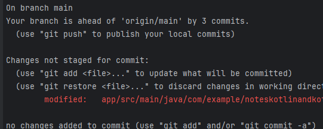

#  GIT GENEL KULLANIMI 

## git init nedir ? 
-> git init komutu, yeni bir Git deposu oluşturmak için kullanılan temel bir Git komutudur. 
Mevcut bir dizini Git deposuna dönüştürür veya boş bir dizinde yeni bir depo başlatır.

-> git Dizini Oluşturulur: Komut, mevcut dizinin kök dizininde .git adında gizli bir dizin oluşturur.
Bu dizin, Git deposunun tüm meta verilerini, geçmişini, konfigürasyonunu ve 
diğer önemli bilgilerini içerir.

-> Çalışma Dizini Hazırlanır: Mevcut dizin, artık bir Git çalışma dizini haline gelir.
Bu, Git tarafından izlenen ve değişikliklerin kaydedildiği dizindir.

## git config  nedir ? 
git config komutu, Git'in yapılandırma ayarlarını yönetmek için kullanılan bir komuttur. 
Bu komut ile Git'in nasıl davranacağını, kullanıcı bilgilerini, uzak depoları ve 
diğer ayarları yapılandırabilirsiniz.

## git config --global user.name  ve git config --global user.name "Fatih Dengiz"
-> user.name : kullanıcı adını öğrenmek için kullanılır ve aynı zamanda kullanıcı adını değiştirmek
içinde kullanılır .
-> ismi değiştirme için "" lar kullanılmazsa ilk kelime parçacığı alır. ilk boşluğa kadar olan kısmı.


## git config --global user.email ve git config --global user.email "dengizfth@gmail.com"
-> user.email : kullanıcı emailini öğrenmek için kullanılır ve aynı zamanda kullanıcı emailini değiştirmek
içinde kullanılır .

## git clone <uzak_depo_url>
-> git clone komutu, belirtilen uzak deponun tüm dosyalarını, geçmişini, dallarını ve 
diğer meta verilerini yerel makinenize indirir. Bu, uzak deponun tam bir kopyasını oluşturur ve 
yerel olarak üzerinde çalışmanıza olanak tanır.
-> git clone https://github.com/username/repository.git

## git clone --branch branchName <uzak_depo_url>
-> git clone branch branchName <uzak_depo_url> komutu, belirtilen bir Git deposunu kopyalarken direkt
 olarak main branch'ini (dalını) çekmenizi sağlar. Normalde git clone komutu varsayılan olarak uzak
 deponun main branch'ini kopyalar, ancak bazı durumlarda farklı bir varsayılan branch kullanılıyor 
 olabilir. Bu komut ise, hangi branch'in varsayılan olarak kullanıldığına bakmaksızın, 
 main branch'ini kopyalamanızı garanti eder.
 * git clone: Git deposunu kopyalamak için kullanılan temel komut.
 * branch main: main branch'ini kopyalamak istediğinizi belirtir.
 * <repo link>: Kopyalamak istediğiniz Git deposunun URL'si.
### git clone --single-branch branchName <uzak_depo_url>
-> sadece belirtilen branch'in geçmişini alarak yukarıdaki işlemleri gerçekleştirir.
* Not: Diğer brach'lerinde geçmişini ve erişimi istemek için direk "git clone" yeterli olucaktır

## git status
->Git deponuzun şu anki durumunu görüntülemek için kullanılan temel bir Git komutudur. 
Bu komut, çalışma dizininizdeki ve staging alanınızdaki değişiklikleri, izlenmeyen dosyaları ve 
branch bilgilerini gösterir.
* **Hangi branch'te olduğunuzu:** Mevcut branch'inizi gösterir.
* **Değiştirilen dosyalar:** İzlenen dosyalarda yapılan değişiklikleri listeler.
* **Staging alanındaki dosyalar:** Commit edilmek üzere staging alanına eklenen dosyaları gösterir.
* **İzlenmeyen dosyalar:** Git deposu tarafından henüz izlenmeyen yeni dosyaları listeler.
* **Commit edilmemiş değişiklikler:** Henüz commit edilmemiş değişiklikleri gösterir.
* Örnek Çıktı
```
  On branch main
  Your branch is up to date with 'origin/main'.
  
  Changes to be committed:
    (use "git restore --staged <file>..." to unstage)
      modified:   card_view.xml
  
  Changes not staged for commit:
    (use "git add <file>..." to update what will be committed)
    (use "git restore <file>..." to discard changes in working directory)
      modified:   MainActivity.kt
  
  Untracked files:
    (use "git add <file>..." to include in what will be committed)
      recycler_view.xml
```
**Özet Açıklama :**

* `On branch main`: Mevcut branch'in `main` olduğunu gösterir.
* `Your branch is up to date with 'origin/main'`: Yerel `main` branch'inizin uzak `origin/main` branch'i ile aynı olduğunu gösterir.
* `Changes to be committed`: Staging alanında commit edilmeyi bekleyen değişiklikler.
* `Changes not staged for commit`: Çalışma dizininde yapılan ancak henüz staging alanına eklenmemiş değişiklikler.
* `Untracked files`: Git deposu tarafından henüz izlenmeyen yeni dosyalar.
* `nothing to commit`: commit yapıladığını belirtiyor.

  * Not: ->Ana brach ismi değişiklik gösterebilir . main-master-dev-develop vs. 
         -> Ana brach ismini kendin verebilirsin ya da verilmiş olabilir.
    
    -> Kırmızı yazı : git add ve commit atılmamış bir değişikliğin var ve bu stage area'da değil.
        
    
    -> kırmızı yazı alanı yukarıdaki ile aynı
    -> Yeşil Yazı :  git add yapıldı ve stage alanına geçirildi ve stage alanında push'lamayı bekleyecek.

    Not : git add ile staging area'ya ekleriz . stagin area'ya eklediğimiz değişiklikleri commit'leriz
  daha sonra git push origin main(brach adı) ile uzaktaki repoya push'larız.

    ## untracked file
* `untracked file`:  Git deponuz tarafından henüz izlenmeyen bir dosyadır. 
* Yani, bu dosya depo geçmişinizde yer almaz ve Git tarafından değişiklikleri takip edilmez.
  **Untracked Dosyaların Özellikleri:**

* **Yeni Dosyalar:** Genellikle yeni oluşturulan dosyalar untracked olarak başlar.
* **`.gitignore` Dosyasında Belirtilen Dosyalar:** `.gitignore` dosyasında belirtilen dosyalar ve dizinler de untracked olarak kabul edilir ve Git tarafından izlenmez.
* **Değişiklikleri Takip Edilmez:** Untracked dosyalar üzerinde yapılan değişiklikler, `git status` komutu ile listelenir ancak Git tarafından versiyonlanmaz.
  
* **Untracked Dosyaları İzlemeye Başlama:**

Untracked bir dosyayı Git tarafından izlemeye başlamak için, **`git add dosyaAdi`** komutunu kullanarak dosyayı staging area'ya eklemeniz gerekir. Bu işlem, dosyayı izlenen dosyalar listesine ekler ve bir sonraki commit'te depolanmasını sağlar.

### git status -b  ve git status -s kısa açıklamalı geri dönüşleri sağlar


## git add 
    -> nokta .(all) anlamındadır . Bütün hepsini alır.
    -> git add dosyaAdi şeklinde sadece bir dosyayı add yapabiliriz. staged area'alır.Commite hazırdır.
    -> untracked file olan bir dosyayı git üzerinden takip edilmesi için git add dosyaAdı şeklinde de ekleyebiliriz.
    
    -> nokta .(all) demek . "git add ."
    -> git add --all  ve git add --a  untract file 'dakiler dahil her şeyi stage area'ya ekler

## git reset : dikkat edilmesi gereken bir konu! Kullanım öncesi 2 kere düşün
    -> Git'te değişiklikleri geri almak veya staging area'yı temizlemek için kullanılan güçlü ve 
çok yönlü bir komuttur. Bu komut, farklı parametrelerle kullanılarak farklı işlemler gerçekleştirir 
ve dikkatli kullanılması gerekir.


* **`--soft`:** Bu parametre, sadece **HEAD işaretçisini** belirtilen commit'e taşır. Çalışma dizininiz ve staging area'nızdaki değişiklikler korunur. Bu, son commit'i geri almak ve değişiklikleri tekrar düzenlemek istediğinizde kullanışlıdır.
* **`--mixed` (Varsayılan):** Bu parametre, **HEAD işaretçisini** belirtilen commit'e taşır ve **staging area'yı temizler.** Çalışma dizininizdeki değişiklikler korunur. Bu, staging area'yı temizlemek ve değişiklikleri tekrar eklemek istediğinizde kullanışlıdır.
* **`--hard`:** Bu parametre, **HEAD işaretçisini** belirtilen commit'e taşır, **staging area'yı temizler ve çalışma dizininizdeki değişiklikleri de siler.** Bu, tüm değişiklikleri geri almak ve belirtilen commit'e geri dönmek istediğinizde kullanışlıdır. **DİKKAT:** Bu seçenekle yapılan değişiklikler geri alınamaz.

 -> git reset komutunu kullanırken, genellikle bir commit referansı belirtirsiniz. Bu referans, bir commit'in SHA-1 hash'i, bir branch adı veya HEAD'e göre göreceli bir referans olabilir.
       |- git reset --soft HEAD~1
       |- git reset HEAD
       |- git reset --hard <commit_hash>
 

## git diff 
    ->  değişiklikleri karşılaştırmak için kullanılan temel bir araçtır. Bu komut, 
farklı dosya sürümleri, commit'ler, branch'ler ve hatta staging area ile çalışma dizini arasındaki 
farkları gösterir. git diff komutunun birçok farklı kullanım senaryosu vardır ve bu senaryoları
anlamak, Git'i etkili bir şekilde kullanmak için önemlidir.
    -> git diff --staged  : stage areadaki değişiklikleri gösterir.
    -> git diff  : staged area'da olmayan diğer değişiklikleri verir.
    -> git reset yaparak staged area'daki değişiklikleri geri alır .
    
HEAD = Branch(dal)

**`git diff` Komutunun Kullanım Senaryoları:**

1. **Çalışma Dizini ile Staging Area Arasındaki Farkları Görüntüleme:**

    - `git diff` komutu, herhangi bir parametre olmadan kullanıldığında, çalışma dizininizdeki değişiklikler ile staging area'daki değişiklikler arasındaki farkları gösterir. Bu, hangi değişikliklerin commit'e hazır olduğunu ve hangilerinin hala düzenleme aşamasında olduğunu görmenizi sağlar.

   ```bash
   git diff
   ```

2. **İki Commit Arasındaki Farkları Görüntüleme:**

    - `git diff <commit_1> <commit_2>` komutu, iki commit arasındaki farkları gösterir. Bu, belirli bir zaman aralığında hangi değişikliklerin yapıldığını anlamanızı sağlar.

   ```bash
   git diff HEAD~1 HEAD
   ```

3. **Bir Branch ile Başka Bir Branch Arasındaki Farkları Görüntüleme:**

    - `git diff <branch_1> <branch_2>` komutu, iki branch arasındaki farkları gösterir. Bu, farklı branch'lerde yapılan değişiklikleri karşılaştırmanızı sağlar.

   ```bash
   git diff main feature-branch
   ```

4. **Bir Dosyanın Farklı Sürümleri Arasındaki Farkları Görüntüleme:**

    - `git diff <dosya_adı>` komutu, belirtilen dosyanın çalışma dizinindeki sürümü ile staging area'daki sürümü arasındaki farkları gösterir.
    - `git diff --cached <dosya_adı>` komutu, belirtilen dosyanın staging area'daki sürümü ile son commit'teki sürümü arasındaki farkları gösterir.
    - `git diff <commit_1> <commit_2> <dosya_adı>` komutu, belirtilen dosyanın iki commit arasındaki farklarını gösterir.

   ```bash
   git diff README.md
   git diff --cached README.md
   git diff HEAD~1 HEAD README.md
   ```

5. **Belirli Bir Satır Aralığındaki Farkları Görüntüleme:**

    - `git diff -U<satır_sayısı> <dosya_adı>` komutu, belirtilen dosyadaki değişikliklerin etrafındaki belirli sayıda satırı da gösterir. Bu, değişikliklerin bağlamını anlamanızı sağlar.

   ```bash
   git diff -U3 README.md
   ```

6. **İstatistiksel Bilgileri Görüntüleme:**

    - `git diff --stat` komutu, değişikliklerin özetini gösterir, hangi dosyaların değiştiğini ve her dosyada kaç satır eklendiğini veya silindiğini gösterir.

   ```bash
   git diff --stat
   ```

**`git diff` Komutunun Parametreleri:**

`git diff` komutu, birçok farklı parametre ile kullanılabilir. En yaygın kullanılan parametrelerden bazıları şunlardır:

* `--cached`: Staging area'daki değişiklikleri gösterir.
* `--staged`: `--cached` ile aynıdır.
* `-p` veya `--patch`: Değişiklikleri patch formatında gösterir.
* `-U<satır_sayısı>`: Değişikliklerin etrafındaki belirli sayıda satırı gösterir.
* `--stat`: Değişikliklerin özetini gösterir.
* `--color`: Değişiklikleri renkli olarak gösterir.

## git commit -m "commit ekle"
    -> git add'den sonra staged area'ya alınan verilere commit atılır ve geriye sadece pushlama kalır.
    -> pushlamadan önce git fetch yapıp uzaktaki repodaki değişiklikleri local'a çekmek gerekir.

## git log
    -> atılan commitleri gösterir 
    -> localdeki commitleri ve uzak repodaki commitleri gösterir

**`git log` Komutunun Kullanım Senaryoları:**

1. **Depo Geçmişini İnceleme:**

    - `git log` komutu, herhangi bir parametre olmadan kullanıldığında, depo geçmişini kronolojik sırayla listeler. Bu, proje üzerinde yapılan değişiklikleri, kimin tarafından yapıldığını ve ne zaman yapıldığını görmenizi sağlar.

   ```bash
   git log
   ```

2. **Belirli Bir Sayıda Commit'i Görüntüleme:**

    - `git log -<sayı>` komutu, belirtilen sayıda commit'i gösterir. Örneğin, son 5 commit'i görmek için `git log -5` komutunu kullanabilirsiniz.

   ```bash
   git log -5
   ```

3. **Belirli Bir Tarih Aralığındaki Commit'leri Görüntüleme:**

    - `git log --since=<tarih>` ve `git log --until=<tarih>` komutları, belirtilen tarih aralığındaki commit'leri gösterir. Tarih, çeşitli formatlarda belirtilebilir (örneğin, "2023-10-27", "yesterday", "2 weeks ago").

   ```bash
   git log --since="2023-10-26" --until="2023-10-27"
   ```

4. **Belirli Bir Yazarın Commit'lerini Görüntüleme:**

    - `git log --author=<yazar>` komutu, belirtilen yazarın commit'lerini gösterir.

   ```bash
   git log --author="John Doe"
   ```

5. **Belirli Bir Dosyada Yapılan Değişiklikleri Görüntüleme:**

    - `git log -p <dosya_adı>` komutu, belirtilen dosyada yapılan değişiklikleri gösterir.

   ```bash
   git log -p README.md
   ```

6. **Birleşme (Merge) Commit'lerini Görüntüleme:**

    - `git log --merges` komutu, sadece birleşme commit'lerini gösterir.

   ```bash
   git log --merges
   ```

7. **Grafiksel Olarak Geçmişi Görüntüleme:**

    - `git log --graph` komutu, branch'lerin ve birleşmelerin görsel bir temsilini gösterir.

   ```bash
   git log --graph
   ```

8. **Kısa Bir Özet Görüntüleme:**

    - `git log --oneline` komutu, her commit için tek bir satırda özet bilgi gösterir.

   ```bash
   git log --oneline
   ```

**`git log` Komutunun Parametreleri:**

`git log` komutu, birçok farklı parametre ile kullanılabilir. En yaygın kullanılan parametrelerden bazıları şunlardır:

* `-p` veya `--patch`: Her commit'in değişikliklerini gösterir.
* `--stat`: Her commit'in hangi dosyaları değiştirdiğini ve kaç satır eklendiğini veya silindiğini gösterir.
* `--pretty=<format>`: Çıktının formatını özelleştirmenizi sağlar.
* `--oneline`: Her commit için tek bir satırda özet bilgi gösterir.
* `--graph`: Branch'lerin ve birleşmelerin görsel bir temsilini gösterir.
* `--author=<yazar>`: Belirtilen yazarın commit'lerini gösterir.
* `--since=<tarih>` ve `--until=<tarih>`: Belirtilen tarih aralığındaki commit'leri gösterir.
* `-<sayı>`: Belirtilen sayıda commit'i gösterir.


## git push  ya da git push origin main
    git push <uzak_depo_adı> <branch_adı>
    -> <uzak_depo_adı>: Uzak deponun adıdır. Genellikle origin olarak adlandırılır.
    -> <branch_adı>: Yerel olarak yaptığınız değişiklikleri içeren branch'in adıdır. 
        Genellikle main veya master branch'ine push yapılır.
* **`-u` veya `--set-upstream`:** Bu parametre, yerel branch'i uzak branch ile ilişkilendirir. 
* Bu sayede, bir sonraki push işleminde sadece `git push` komutunu kullanmanız yeterli olur.

   ```bash
   git push -u origin main
   ```

* **`-f` veya `--force`:** Bu parametre, uzak depoya zorla push yapmanızı sağlar. 
*  Bu, uzak depoda yapılan değişiklikleri ezebileceği için dikkatli kullanılmalıdır.

   ```bash
   git push -f origin main
   ```
* **`--tags` :** etiketleme işlemi , tag üzerinden 

   ```bash
   git push -f origin main
   ```